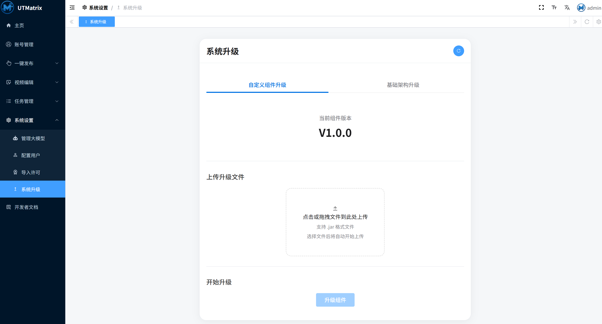
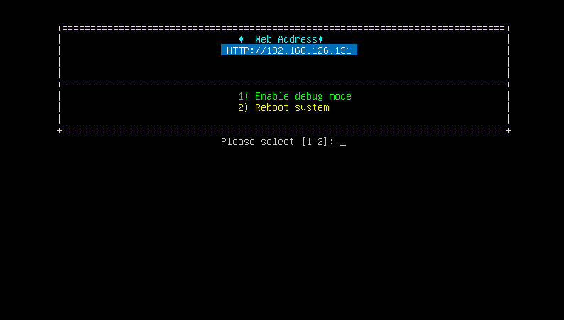

# Media Uploader

Media Uploader 是 [UTMatrix](https://www.utmatrix.top) 的媒体上传组件，用于一键上传视频/文章到多个平台，
该组件可配合 [UTMatrix](https://www.utmatrix.top) 系统使用。
 
UTMatrix官网地址：[https://www.utmatrix.top](https://www.utmatrix.top)
 
UTMatrix系统在线DEMO访问地址：[https://utmatrix.vercel.app](https://utmatrix.vercel.app)
 

## 目录

- [组件说明](#组件说明)
  - [系统架构](#系统架构)
  - [添加账号流程](#添加账号流程)
  - [上传视频流程](#上传视频流程)
- [功能实现](#功能实现)
- [环境要求](#环境要求)
- [新增上传器](#新增上传器)
  - [新增视频上传平台](#新增视频上传平台)
    - [放入 logo](#1放入logo)
    - [实现接口](#2实现接口)
    - [注册 SPI 服务](#3注册spi服务)
  - [新增文章上传平台](#新增文章上传平台)
    - [放入 logo](#1放入logo-1)
    - [实现接口](#2实现接口-1)
    - [注册 SPI 服务](#3注册spi服务-1)
- [安装说明](#安装说明)
- [调试](#调试)
- [贡献指南](#贡献指南)
- [常见问题](#常见问题)
- [联系方式](#联系方式)
- [致谢](#致谢)

## 组件说明
### 系统架构
本组件为 UTMatrix 的官方上传组件，提供完整的媒体文件上传功能支持。

### 1、添加账号流程

### 2、上传视频流程

## 功能实现

- 平台LOGO设置
- 识别用户名和头像
- 视频上传/文档上传到不同平台

## 环境要求
- Java 8

## 新增上传器

本项目使用SPI机制支持自定义上传器的扩展。您可以通过以下步骤添加新的上传器：

### 1. 新增视频上传平台

#### 1）放入logo
将新增平台的logo放入`src/main/resources/logo`下（在步骤2的接口实现中会引入）

#### 2）实现接口
创建新的上传器类并实现 [VideoUploader](https://gitee.com/when-bean/uploader/blob/master/src/main/java/com/g/uploader/VideoUploader.java) 接口，可参考[BilibiliVideoUploader.java](src%2Fmain%2Fjava%2Fcom%2Fg%2Fmedia%2Fuploader%2Fcomponent%2Fvideo%2FBilibiliVideoUploader.java)：

#### 3）注册SPI服务

在 [com.g.uploader.VideoUploader](src%2Fmain%2Fresources%2FMETA-INF%2Fservices%2Fcom.g.uploader.VideoUploader) 最后一行添加新增的平台类：
> com.g.media.uploader.component.video.BilibiliVideoUploader
com.g.media.uploader.component.video.WechatVideoUploader
com.g.media.uploader.component.video.DouYinVideoUploader
com.g.media.uploader.component.video.KuaiShouVideoUploader
com.g.media.uploader.component.video.WeiShiVideoUploader
com.g.media.uploader.component.video.XiaoHongShuVideoUploader
> **_com.g.media.uploader.component.video.YourVideoUploader_**

### 2. 新增文章上传平台

#### 1）放入logo
将新增平台的logo放入`src/main/resources/logo`下（在步骤2的接口实现中会引入）

#### 2）实现接口
创建新的上传器类并实现 [ArticleUploader](https://gitee.com/when-bean/uploader/blob/master/src/main/java/com/g/uploader/ArticleUploader.java) 接口，可参考[DaYuArticleUploader.java](src%2Fmain%2Fjava%2Fcom%2Fg%2Fmedia%2Fuploader%2Fcomponent%2Farticle%2FDaYuArticleUploader.java)：

#### 3）注册SPI服务

在 [com.g.uploader.ArticleUploader](src%2Fmain%2Fresources%2FMETA-INF%2Fservices%2Fcom.g.uploader.ArticleUploader) 最后一行添加新增的平台类：
> com.g.media.uploader.component.article.SouHuArticleUploader
com.g.media.uploader.component.article.TouTiaoHaoArticleUploader
com.g.media.uploader.component.article.ZhiHuArticleUploader
com.g.media.uploader.component.article.DaYuArticleUploader
> **_com.g.media.uploader.component.video.YourArticleUploader_**

## 安装说明
#### 1）打包jar
使用maven打包项目，得到一个jar文件

#### 2）导入文件
登录UTMatrix，进入 **系统设置**->**系统升级**->**自定义组件升级**，导入打包好的jar包

#### 3）检测是否成功导入
登录UTMatrix，进入 **账号管理**，点击添加账号，可以看到成功添加的平台logo

## 调试
#### 1）启用DEBUG模式
进入UTMatrix的VNC界面，选择"1"，启用DEBUG模式，IDEA设置远程调试地址和端口（5005），即可断点调试

## 贡献指南

1. Fork 本仓库
2. 创建新的分支
3. 提交您的修改
4. 发起 Pull Request

## 常见问题

### Q: 如何扩展页面的参数？
A: 上传媒体文件时，有个选项 **其他设置** ，对应接口中的extraConfig方法，可自行解析处理该参数

### Q: 如何调式代码？
A: 请参考[调试](#调试)章节

## 联系方式
- 官网地址： https://www.utmatrix.top
- 邮箱： whenbean@foxmail.com

## 致谢

感谢所有贡献者对本项目的支持！
